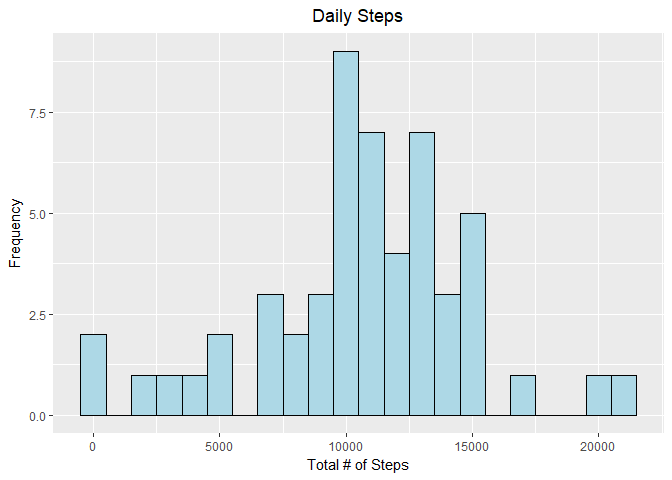
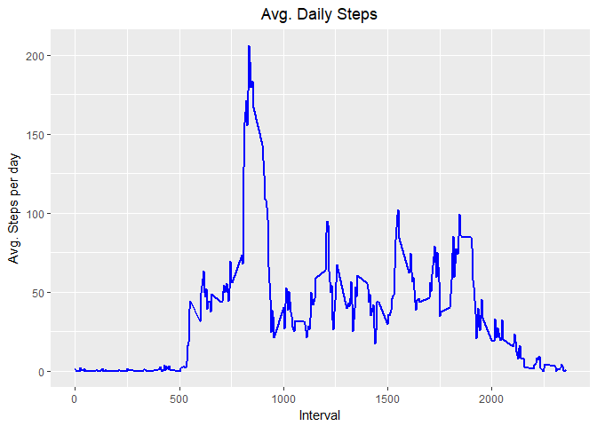
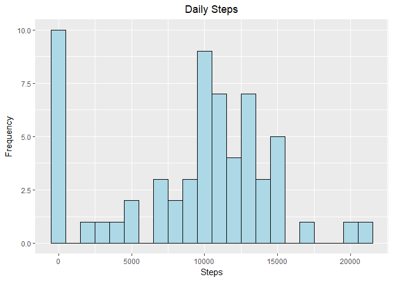
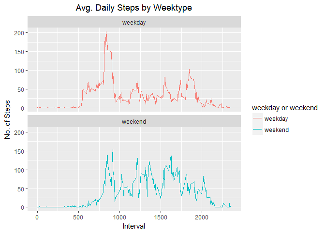

## Introduction
It is now possible to collect a large amount of data about personal movement using activity monitoring devices such as a Fitbit, Nike Fuelband, or Jawbone Up. These type of devices are part of the “quantified self” movement – a group of enthusiasts who take measurements about themselves regularly to improve their health, to find patterns in their behavior, or because they are tech geeks. But these data remain under-utilized both because the raw data are hard to obtain and there is a lack of statistical methods and software for processing and interpreting the data.

This assignment makes use of data from a personal activity monitoring device. This device collects data at 5 minute intervals through out the day. The data consists of two months of data from an anonymous individual collected during the months of October and November, 2012 and include the number of steps taken in 5 minute intervals each day.

The data for this assignment can be downloaded from the course web site:

* Dataset: [Activity monitoring data] (https://d396qusza40orc.cloudfront.net/repdata%2Fdata%2Factivity.zip) 

The variables included in this dataset are:

* steps: Number of steps taking in a 5-minute interval (missing values are coded as NA𝙽𝙰) </br>
* date: The date on which the measurement was taken in YYYY-MM-DD format </br>
* interval: Identifier for the 5-minute interval in which measurement was taken </br>

The dataset is stored in a comma-separated-value (CSV) file and there are a total of 17,568 observations in this dataset. 


### Loading and preprocessing the data
Show any code that is needed to

1) Load the data (i.e. read.csv())
   

```r
library("data.table")
library(ggplot2)
#Unzip the activity file. The activity file is already in the forked branch
unzip("activity.zip")
```

2) Process/transform the data (if necessary) into a format suitable for your analysis

```r
# read the data from the activity csv file into a Data Table called dt_activity. 
dt_activity<- data.table::fread(input = "activity.csv")
head(dt_activity)
```

```
##    steps       date interval
## 1:    NA 2012-10-01        0
## 2:    NA 2012-10-01        5
## 3:    NA 2012-10-01       10
## 4:    NA 2012-10-01       15
## 5:    NA 2012-10-01       20
## 6:    NA 2012-10-01       25
```

### What is mean total number of steps taken per day?
For this part of the assignment, you can ignore the missing values in the dataset.

1) Calculate the total number of steps taken per day

```r
totalNumSteps <- dt_activity[,c(lapply(.SD,sum,na.rm=FALSE)),.SDcols=c("steps"),by=.(date)]
head(totalNumSteps)
```

```
##          date steps
## 1: 2012-10-01    NA
## 2: 2012-10-02   126
## 3: 2012-10-03 11352
## 4: 2012-10-04 12116
## 5: 2012-10-05 13294
## 6: 2012-10-06 15420
```


2) If you do not understand the difference between a histogram and a barplot, research the difference between them. Make a histogram of the total number of steps taken each day


```r
histPlot <- ggplot(totalNumSteps, aes(x = steps)) 
  histPlot + geom_histogram(color="black",fill = "lightblue", binwidth = 1000) +
             labs(title = "Daily Steps", x = "Total # of Steps", y = "Frequency") +
             theme(plot.title = element_text(hjust = 0.5))
```

<!-- -->

3) Calculate and report the mean and median of the total number of steps taken per day

```r
  totalNumSteps[,.(Mean_Steps=mean(steps,na.rm=TRUE),Median_Steps=median(steps,na.rm=TRUE))]
```

```
##    Mean_Steps Median_Steps
## 1:   10766.19        10765
```

```r
head(totalNumSteps)
```

```
##          date steps
## 1: 2012-10-01    NA
## 2: 2012-10-02   126
## 3: 2012-10-03 11352
## 4: 2012-10-04 12116
## 5: 2012-10-05 13294
## 6: 2012-10-06 15420
```


### What is the average daily activity pattern?

1) Make a time series plot (i.e. type="l") of the 5-minute interval (x-axis) and the average number of steps taken, averaged across all days (y-axis).


```r
dt_avg_intervals <- dt_activity[, c(lapply(.SD, mean, na.rm = TRUE)), .SDcols = c("steps"), by = .(interval)] 
  
  tsPlot<-ggplot(dt_avg_intervals, aes(x = interval , y = steps)) 
    tsPlot + geom_line(color="blue", size=1) + 
    labs(title = "Avg. Daily Steps", x = "Interval", y = "Avg. Steps per day") +
    theme(plot.title = element_text(hjust = 0.5))
```

<!-- -->


2)Which 5-minute interval, on average across all the days in the dataset, contains the maximum number of steps?

```r
    dt_avg_intervals[steps == max(steps), .(max_interval = interval)]
```

```
##    max_interval
## 1:          835
```

```r
    head(dt_avg_intervals)
```

```
##    interval     steps
## 1:        0 1.7169811
## 2:        5 0.3396226
## 3:       10 0.1320755
## 4:       15 0.1509434
## 5:       20 0.0754717
## 6:       25 2.0943396
```


### Imputing missing values
1) Calculate and report the total number of missing values in the dataset (i.e. the total number of rows with NAs)


```r
    dt_activity[is.na(steps), .N ]
```

```
## [1] 2304
```

```r
    head(dt_activity)
```

```
##    steps       date interval
## 1:    NA 2012-10-01        0
## 2:    NA 2012-10-01        5
## 3:    NA 2012-10-01       10
## 4:    NA 2012-10-01       15
## 5:    NA 2012-10-01       20
## 6:    NA 2012-10-01       25
```

2) Devise a strategy for filling in all of the missing values in the dataset. The strategy does not need to be sophisticated. For example, you could use the mean/median for that day, or the mean for that 5-minute interval, etc.


```r
    dt_activity[is.na(steps), "steps"] <- dt_activity[, c(lapply(.SD, median, na.rm = TRUE)), .SDcols = c("steps")]
```

3) Create a new dataset that is equal to the original dataset but with the missing data filled in.


```r
      data.table::fwrite(x = dt_activity, file = "newDataset.csv", quote = FALSE)    
```

4) Make a histogram of the total number of steps taken each day and Calculate and report the mean and median total number of steps taken per day. Do these values differ from the estimates from the first part of the assignment? What is the impact of imputing missing data on the estimates of the total daily number of steps?


```r
   # total number of steps taken per day
    totalNumSteps_impute <- dt_activity[, c(lapply(.SD, sum)), .SDcols = c("steps"), by = .(date)] 
    
    # mean and median total number of steps taken per day
    totalNumSteps_impute[, .(Mean_Steps = mean(steps), Median_Steps = median(steps))]
```

```
##    Mean_Steps Median_Steps
## 1:    9354.23        10395
```

```r
    imputePlot<- ggplot(totalNumSteps_impute, aes(x = steps))  
      imputePlot + geom_histogram(color="black",fill="lightblue", binwidth = 1000) + 
      labs(title = "Daily Steps", x = "Steps", y = "Frequency") +
      theme(plot.title = element_text(hjust = 0.5))
```

<!-- -->


### Are there differences in activity patterns between weekdays and weekends?

1) Create a new factor variable in the dataset with two levels – “weekday” and “weekend” indicating whether a given date is a weekday or weekend day.


```r
      dt_activity[, date := as.POSIXct(date, format = "%Y-%m-%d")]
      dt_activity[, `Day of Week`:= weekdays(x = date)]
      dt_activity[grepl(pattern = "Monday|Tuesday|Wednesday|Thursday|Friday", 
                        x = `Day of Week`), "weekday or weekend"] <- "weekday"
      dt_activity[grepl(pattern = "Saturday|Sunday", x = `Day of Week`), 
                  "weekday or weekend"] <- "weekend"
      dt_activity[, `weekday or weekend` := as.factor(`weekday or weekend`)]
```

2) Make a panel plot containing a time series plot (i.e. type="l") of the 5-minute interval (x-axis) and the average number of steps taken, averaged across all weekday days or weekend days (y-axis).


```r
    dt_activity[is.na(steps), "steps"] <- 
              dt_activity[, c(lapply(.SD, median, na.rm = TRUE)),.SDcols = c("steps")]
    dt_typeOfDayInterval <- 
              dt_activity[, c(lapply(.SD, mean, na.rm = TRUE)), 
                                     .SDcols = c("steps"), 
                                      by = .(interval, `weekday or weekend`)] 
      
      panelPlot<- ggplot(dt_typeOfDayInterval , aes(x = interval , y = steps,
                                                    color=`weekday or weekend`)) 
      panelPlot + geom_line() + 
                  labs(title = "Avg. Daily Steps by Weektype", 
                       x = "Interval", y = "No. of Steps") + 
        facet_wrap(~`weekday or weekend` , ncol = 1, nrow=2) +
                  theme(plot.title = element_text(hjust = 0.5))
```

<!-- -->

